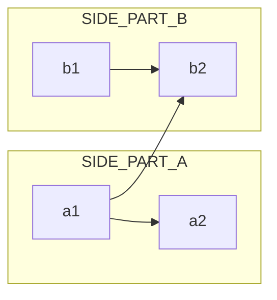
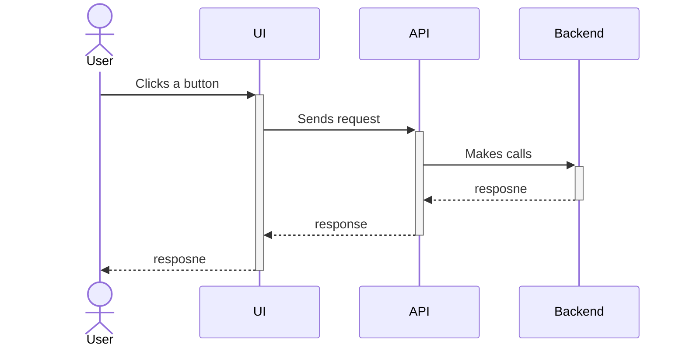
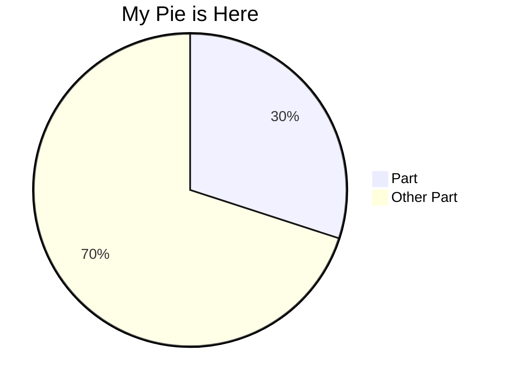

# mermaid-template-sample
trying out mermaid sample on readme

# Diagrams

```mermaid
flowchart LR
  subgraph SIDE_PART_A
    a1 --> a2
  end
  subgraph SIDE_PART_B
    b1 --> b2
  end
  a1 --> b2
```

```mermaid
sequenceDiagram
  actor User
  participant UI
  participant API
  participant Backend  
  
  User->>+UI: Clicks a button
  UI->>+API: Sends request
  API->>+Backend: Makes calls
  
  Backend-->>-API : resposne
  API-->>-UI : response
  UI-->>-User: resposne
  
```

```mermaid
pie
  title My Pie is Here
  "Part": 30
  "Other Part": 70
```
